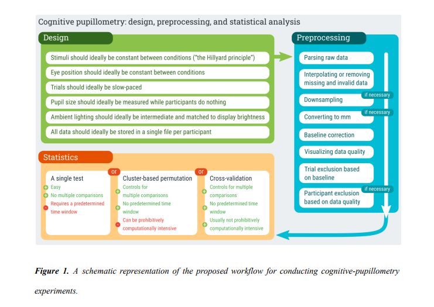

# Introduction

Just a few weeks ago @Mathot released a great primer on pupillometry highlighting the method, providing guidelines on how to preprocess the data, and even offered a few suggestions on how to analyze the data (see their great figure below). This paper will for sure be something I revisit and will be the paper I send to folks interested in pupillometry. In their paper, they discuss fitting linear mixed models (LME) together with cross validation to test time points. While I think there are a lot of benefits of this approach (described in their paper), this method does not tell researchers what they really want to know: where an effect lies in the time course. In the the cross-validation + LME approach, it only takes the time points with highest *z* scores and submits those points to a final LME model. Ultimately, you can say a time point is significant at X, Y, and Z times, but cant really make any claims about the start and end of events. This got me thinking about a paper I read a few years ago by @yu_multi-time-point_2020 which looked at a method called multi-time-point analysis which they applied to fNIRS data. I really like the method (and paper) and began thinking about all the ways it could be applied (e.g., EEG, pupillometry) In the paper, they showed that it is a more powerful tool than the often used mass univariate approach. Here I show how to apply this method to pupillometry data.


```{r, echo=FALSE, warning=FALSE, message=FALSE, fig.align='center', fig.width=14, fig.height=12}


library(knitr)
library(papaja)



```


# Multi-Time Point Analysis (MTPA)

There are a wide-variety of options when deciding on an appropriate analysis strategy to use. It is almost impossible to cover every method. When reviewing papers, I feel bad because I inevitable bring up methods the authors did not include. This blog post adds to the already complicated landscape of time course analysis and add yet another tool to the pupillometry toolbox.

I mostly do these blogs as an aid to help me better understand a method. I also hope it will help others.

To demonstrate MTPA I am going to use a simple example from data I collected as a postdoc at the University of Iowa. In this experiment, individuals (*N*=31) heard normal and 6-channel vocoded speech tokens (single words) and had to click on the correct picture. The vocoded condition should be harder, and in the figure below, you can see that it is--larger pupil size throughout the trial. Commonly, we would test significance by using a mass univariate approach (e.g., *t*-tests at each time point). Below we fit the time course data using Dale Barr's `clusterperm` package with no corrections (with corrections nothing is significant). We see that there is a significant difference between the conditions that emerges starting around 800 ms and ends around 1900 ms. Using MTPA would we observe something different?

```{r message=FALSE, warning=FALSE}

library(pacman)

#devtools::install_github("dalejbarr/clusterperm")


pacman::p_load(ERP, mnormt, fdrtool,
               tidyverse, gridExtra, crayon, 
               boot, reshape2, ggthemes, 
               devtools,randomForest,leaps, pROC, tidyverse, here, gazer, clusterperm)

```


```{r, message=FALSE, warning=FALSE, echo=FALSE}


timebins1 <- read_csv("mtpa_file.csv")


timebins1$Condition<-factor(timebins1$vocoded, level=c("V6", "NS")) 
timebins1$Condition<-factor(timebins1$vocoded, level=c("V6", "NS")) 


runningSE <- timebins1 %>%
  split(.$timebins) %>% 
  map(~Rmisc::summarySEwithin(data = ., measurevar = "aggbaseline", withinvars = "Condition", idvar="subject"))%>%
 bind_rows() %>%
 mutate(Time = rep(unique(timebins1$timebins), each = 2))
    #Note, you'll have to change 2 to match the number of conditions

WSCI.plot <- ggplot(timebins1,aes(timebins, aggbaseline))


mean<- timebins1 %>%
  group_by(subject, vocoded) %>%
  filter(timebins >= 1100 & timebins <=1800) %>%
  summarise(mean_pupil=mean(aggbaseline))


vocode_plot <-ggplot(timebins1)+
    aes(timebins, aggbaseline, linetype=Condition, color=Condition) +
    stat_summary(fun.y = "mean", geom = "line", size = 1) +
    theme_bw() +
    labs(x ="Time (ms)",y ="Pupil Dilation (change from baseline (a.u.))") +
    geom_hline(yintercept=0.0)

vocode_plot


```


```{r}

vo_mu <- aov_by_bin(timebins1, timebins,   # clusterperm package
  aggbaseline ~ vocoded + Error(subject))

vo_mu$p_adjuct<-p.adjust(vo_mu$p, method="none")

vo_mu_p=subset(vo_mu, vo_mu$p_adjuct <= .05)

knitr::kable(vo_mu_p)


```


# Before We Begin: A Summary

Before jumping into the MTPA analysis, I want to explain the method a little bit. The MTPA uses a random forest classifier in conjunction with cross validation to determine if there is a statistical difference in the pupil signal between conditions. This differs slightly from the approach outlined in [@Mathot]. In their approach, linear mixed models are used in conjunction with cross validation to pick samples with the highest Z value. In contrast, MTPA uses all time points. What MTPA does is calculate the area under the curve (AUC) along with 90% confidence intervals and averages them. Significance is determined by whether the CIs cross the .5 threshold. If it does not, there is a difference between conditions at that time point. Below I will outline specific steps needed to perform MTPA along with the R code. 

# Running MPTA in R

1.  We need to read in our sample data (described above) and `pivot_wide` so time is in columns and subjects and conditions are long.  

```{r pivot}
### Read Data
# Read the Data preprocessed by gazer 
vocode<- read.csv("mtpa_file.csv")

vocode_wide<- vocode %>%
  select(-vocoded, -X) %>% 
  group_by(subject, Condition) %>%
  #add T1:27 for time bc weird things when cols are numeric turn condition into factor
 mutate(timebins=rep(paste("T", 1:27, sep=""),by=length(timebins)), Condition=as.factor(Condition)) %>%
    mutate(expt="pupil", Subject=as.factor(subject), Condition=ifelse(Condition=="NS", 0, 1), Condition=as.factor(Condition)) %>%
  ungroup() %>%
  select(-subject) %>%
  pivot_wider(names_from = timebins, values_from = aggbaseline) %>%
  as.data.frame() %>%
  arrange(Condition)%>%
  datawizard::data_reorder(c("expt", "Subject", "Condition")) %>%
  ungroup()

```


2. In MTPA, we must first partition the data into bandwidths(here two), or the number of points to consider at a time in the analysis—-for example with a bandwidth of 2, a model would be built from two time points (e.g., 1 and 2 and then 2 and 3 and so on and so forth until the last time point has been fit). In the matrix below, we see that category membership (Related (R) vs. Unrelated  (U), or in our case normal and vocoded speech) is predicted from the signal at two time points. This is repeated until the last time point. In our example, this is the 27th time point, or 2500 ms. As a note, @yu_multi-time-point_2020 recommend 2 and stated other widths did not result in different conclusions. 


```{r, echo=FALSE, warning=FALSE, Message=FALSE, fig.align='center', fig.width=16, fig.height=8}


library(knitr)

knitr::include_graphics("matrix.png")

```


```{r width}

# Define time point starts at -100 and ends at 2500
tp <- seq(-100,2500,by=100)

### Start MTPA
### Set parameters for MTPA
# Consider 2 time points at each testing
binwidth = 2
```


3. After this, we set our number of cross validations (100 times here), confidence interval,  and our upper (number of time points (here it is 27) - banwidth (2) + 1)) and lower bounds,  and create a matrix to store important model results. 

```{r}


rcvnum <- 100
# Confidence interval
ci <- c(0.05,0.95)
# Set the upper and lower bound 
# number of timepoint - bin + 1
upperbound <- 27-binwidth+1
lowerbound <- 1
# Store the results
rst_vocode <- matrix(NA,6,upperbound)


```


4. For every time point X CV, we fit a random forest model using the training data we created and use the test set for prediction. It is suggested that you sample 60~70% (two-thirds) of the data to train the model, and use the rest 30~40% (one-third) as your testing set. AUC and other important metrics are calculated for each time point and averaged together and stored in a matrix before going to the next time point. In our example we make sure that an equal number of normal speech and vocoded speech conditions are in each training and test sample. 


```{r,warning=FALSE, message=FALSE}
### Start MTPA model fitting with RF
for (i in lowerbound:upperbound){
  # Record the AUC and CE
  ceauc <- matrix(NA,4,rcvnum)
  # Start cross validation
  for (k in 1:rcvnum){
    # Set seed for reproducible research
    set.seed(k)
    # Training and Testing Data
    idc_test <- c(sample(1:30,5),sample(31:62,5))
    idc_train <- -idc_test
    # Fit an RF model
    fit <- randomForest(Condition~.,data=vocode_wide[idc_train,c(2,3,(i+3):(i+3+binwidth-1))],importance = F)
    yhat_test_prob <- predict(fit,newdata = vocode_wide[idc_test,],type = "prob")[,2]
    yhat_test_class <- predict(fit,newdata = vocode_wide[idc_test,],type = "class")
    # Record the results of RF fitting on Testing data
    ce_test <- mean(yhat_test_class!=vocode_wide[idc_test,]$Condition)
    auc_test <- pROC::auc(vocode_wide[idc_test,]$Condition,yhat_test_prob)
    ceauc[2,k] <- ce_test
    ceauc[4,k] <- auc_test
  }
  # Store the results of CV
  rst_vocode[1,i] <- mean(ceauc[2,])
  rst_vocode[2,i] <- mean(ceauc[4,])
  rst_vocode[3,i] <- quantile(ceauc[2,],probs = c(ci[1],ci[2]))[1]
  rst_vocode[4,i] <- quantile(ceauc[2,],probs = c(ci[1],ci[2]))[2]
  rst_vocode[5,i] <- quantile(ceauc[4,],probs = c(ci[1],ci[2]))[1]
  rst_vocode[6,i] <- quantile(ceauc[4,],probs = c(ci[1],ci[2]))[2]
}
# Reorganize the results, average all the time points that used to estimate the results
vocodem <- matrix(NA,6,27)
vocodem[,1] <- rst_vocode[,1]
vocodem[,27] <- rst_vocode[,26]
for (i in 1:(upperbound-1)){
  tpi <- i + 1
  vocodem[1,tpi] <- mean(rst_vocode[1,c((i+lowerbound-1):(i+lowerbound-1+binwidth-1))])
  vocodem[2,tpi] <- mean(rst_vocode[2,c((i+lowerbound-1):(i+lowerbound-1+binwidth-1))])
  vocodem[3,tpi] <- mean(rst_vocode[3,c((i+lowerbound-1):(i+lowerbound-1+binwidth-1))])
  vocodem[4,tpi] <- mean(rst_vocode[4,c((i+lowerbound-1):(i+lowerbound-1+binwidth-1))])
  vocodem[5,tpi] <- mean(rst_vocode[5,c((i+lowerbound-1):(i+lowerbound-1+binwidth-1))])
  vocodem[6,tpi] <- mean(rst_vocode[6,c((i+lowerbound-1):(i+lowerbound-1+binwidth-1))])
}
vocodem <- as.data.frame(vocodem) # turn into df 
colnames(vocodem) <- paste0("Time",1:27) #label time
row.names(vocodem) <- c("CE","AUC","CE_l","CE_u","AUC_l","AUC_u") # label metrics

```
5. Finally we transpose the matrix, put time in ms, and plot the AUC at each time point. Where the CIs do not cross the 50% threshold (red dotted line), a significant difference can be said to exist at that time point between conditions. 

```{r}

temp <- as.data.frame(t(vocodem)) # transpose
temp$Times <- tp # turn time into ms 

# plot
ggplot(data = temp,aes(x =Times, y = AUC))+
  geom_line(size = 1.2)+
  geom_ribbon(aes(ymax = AUC_l,ymin = AUC_u),alpha = 0.3)+
  theme_bw() + 
  coord_cartesian(ylim = c(.4, 1)) + 
geom_hline(yintercept=.5, linetype="dashed", 
                color = "red", size=2) + 
  labs(x="Time(ms)")

```

# Conclusions

I have shown how to apply MTPA to pupillometric data. This method appears to be more powerful than a mass univariate approach, showing the whole time course as significant. It would be interesting to see how this compares to the method proposed by @Mathot. I would encourage anyone who is interested in applying this method to also check out @yu_multi-time-point_2020's excellent paper which this blog is based off of. 

## Potential Limitations

While this method looks promising, there does appear to be some limitations. First, it look looks like you can't fit multilevel models. If you can, I suspect it is 1) computationally expensive and 2) not trivial. If anyone has an answer to this I would love to hear it. Second, it appears that you would have to conduct this test for each effect of interest rather then including everything in the model. This is something that @Mathot also brings up in their paper. I will have to do some more investigating, but overall I am quite interested in learning more about ML applications to time course data like pupillometry.

```{r}

sessionInfo()

```

# References
