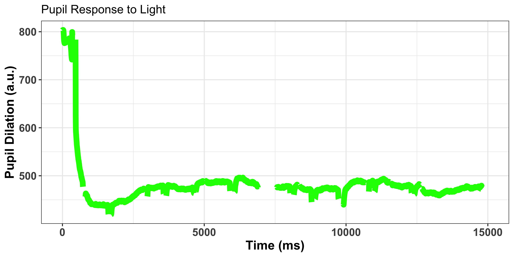
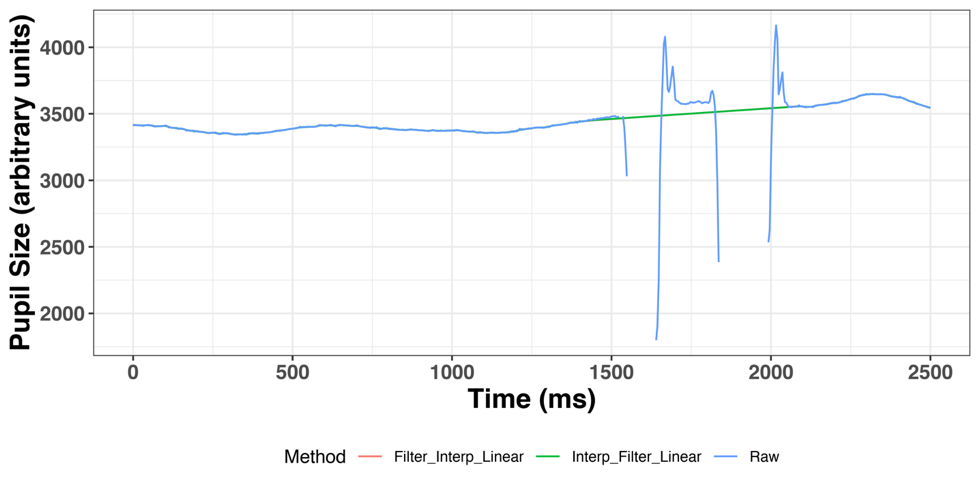
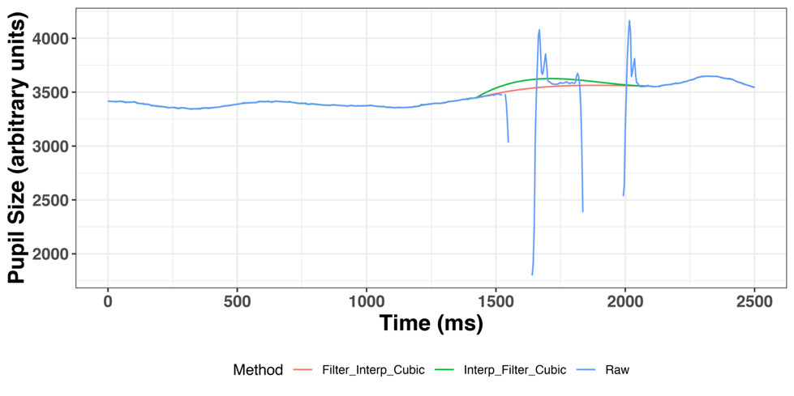

# Cognitive Pupillometry

```{r, include=FALSE}
library(europepmc)
library(cowplot)
library(tidyverse)
```

```{r echo=FALSE, fig.align="center", fig.cap=paste("PubMed search for the keyword [pupillometry] from 1940-2019"), fig.height=4, fig.width=8, warning=FALSE, messages=FALSE}

ot_trend<-europepmc::epmc_hits_trend(query="pupillometry", period=1940:2019)

ot_graph <-ot_trend %>%
ggplot(aes(x=year, y=(query_hits))) + 
geom_col(fill="#56B429", width=.6, alpha=0.9) + scale_y_continuous(expand=c(0,0))+
theme_minimal_hgrid(12) + 
  geom_vline(xintercept=1960, linetype="dotted") + 
labs(x="Year", y = "Published Pupillometry Articles") + ggtitle("Interest in pupillometry research from 1940-2019")

ot_graph
```
---

# Cognitive Pupillometry

.center[]

---
# Why Gazer
--

+ GazeR is a package to pre-process data from gaze (e.g., VWP) and pupillometry experiments

--

+ Not many pipelines available (this is slowly changing)

 - PupillometryR (Sam Forbes)
 - Pupillometry (Jason Tsukahara)
 
--

+ The goal was to create a start to finish pipeline for pupillometry

  - Work in progress, but create a package that can be used by many different eye tracker brands

--

+ Amied to simplify some of the pre-processing decisons

--

+ Much of the psychophysics has been Matlab based, leaving R users out and those who cannot afford Matlab 
---
---
# What does GazeR add?
--

+ Standardized and reproducible pipeline for preprocessing

--

+ Flexibility in choosing which preprocessing methods and parameters are used

--

+ Easy to understand pipeline

--

+ Package can be run in a container through Code Ocean! 

 - No more worrying about OS or package incompatiablies

---

---

# Pupil Pre-processing

+ Read in data 

+ De-blinking

  - Extending blinks
  
+ Interpolation and Smoothing

+ Baseline correction

+ Artifact rejection

  - Missing data
  - Unlikely pupil values
  - Median absolute deviation
  
+ Event time alignment

+ Samples to bins (downsampling)

---

# Get Started
--

- Install the **gazeR** package from [Github](https://github.com/dmirman/gazeR):

```{r eval=TRUE, message=FALSE, warning=FALSE, messages=FALSE, tidy=FALSE, warnings=FALSE}
remotes::install_github("dmirman/gazer")
```

--

```{r eval=TRUE, messages=FALSE, tidy=FALSE}
library(gazer)
```

--

You are recommended to use the [RStudio IDE](https://www.rstudio.com/products/rstudio/), but you do not have to.

---
# Data
+ 4 participants

+ Lexical decison task with easy (type-print) and hard (cursive) trials

+ Data collected with SR EyeLink 1000 plus
---
# Reading in data 

+ SR Data Viewer
+ EDF 
+ Tobii (coming soon)

```{r, echo=TRUE, include=FALSE, messages=FALSE, asis=FALSE}

library(gazer)
library(data.table)
library(tibble)
library(tidyverse)

```

 - SR Data Viewer

```{r, echo=TRUE, eval=FALSE}
# set working directory 
setwd("/Users/gellr/Desktop/r")
#folder path 
file_list <- list.files (path="/Users/gellr/Desktop/r", pattern=".xls")
#specify blink, pupil, and whether it is from sr or raw edf files
merge_files=merge_gazer_files(file_list, blink_colname="AVERAGE_IN_BLINK", pupil_colname="AVERAGE_PUPIL_SIZE", filetype="sr")

```
---

# Reading in data

 - EDF 

```{r, eval=FALSE, echo=TRUE}
directory_edf ="" 
# path to edfs
directory_csv_from_edf_conversion ="" 
# path where csv files should be stored

file_list_edf <- list.files(path=directory_edf, pattern=".edf") 
# get list of edf files
parse_edf(file_list=file_list_edf, 
output_dir = directory_csv_from_edf_conversion, 
type="pupil")) 
# parses edfs and saves them into directory
# folder path to csv folders from parse_edf

file_list_pupil_samp <- list.files(path=directory_csv_from_edf_conversion, 
pattern=".csv") 
# extract the processed csv files from directory_csv_from_edf_conversion

pd <- merge_gazer_files(file_list_pupil_samp, type = "edf") 
# merges all the files from file_list_pupil_samp object

```
---
# Reading in Data Example

```{r}
pupil_path <- system.file("extdata", "pupil_sample_files_edf.xls", package = "gazer")
pupil_raw<-fread(pupil_path)
pupil_raw<-as_tibble(pupil_raw)

knitr::kable(head(pupil_raw))

```

---
# Data Structure

+ Can work with with data from any tracker as long as you have these columns:

```{r, message=FALSE, include=FALSE, warning=FALSE, echo=TRUE, tidy=TRUE}
names_needed <- c("Subject","Trial","Blink", "Pupil Size", "Time", "Message")
```

```{r}
knitr::kable(names_needed, col.names = "Names")
```
---
# De-Blinking

.top[]

---

# De-Blinking

+ Blinks are a major artifact in pupillometry research

 - Eye-trackers treat blinks as missing data
 
+ Values before and after blinks are spurious

+ We need to extend them
--

```{r, echo=TRUE}
pup_extend<- pupil_raw %>% 
  group_by(subject, trial) %>% 
  mutate(extendpupil=extend_blinks(pupil, fillback=100, 
                                   fillforward=100, hz=250))
  
pup_extend1 <- pup_extend %>%
  select(subject, trial, time, pupil, extendpupil)
  
```

---

# Smoothing/Filtering and Interpolation

--

+ Do not throw out data! 

--

+ Let's interpolate and smooth the data instead

--

 - GazeR can do linear or cubic interpolation 
--

+ Smoothing with n moving average or Hanning filter

--

+ Choice seems to matter
   
--
```{r, echo=TRUE}

smooth_interp <- smooth_interpolate_pupil(pup_extend, pupil="pupil", 
                                          extendpupil="extendpupil", 
                                          extendblinks=TRUE, step.first="interp",                                                                      filter="moving", 
                                          maxgap=Inf, type="linear", hz=250, n=5)
```

---

```{r, fig.align="center", out.width = "65%" ,echo=FALSE}




```	
---
# Baseline Correction

+ Subtractive or divisive (grand average baseline)

```{r, message=FALSE}
baseline_pupil <- baseline_correction_pupil(smooth_interp, 
                                            pupil_colname='pup_interp', 
                                            baseline_window=c(500,1000))

baseline_pupil<-baseline_correction_pupil_msg(smooth_interp, pupil_colname='pup_interp', 
                                              baseline_dur=100, event="target", 
                                              baseline_method = "sub")

knitr::kable(head(baseline_pupil))

```
---

# Artifact Rejection: Missingness

+ Should remove trials and subjects with more than 20-30% of data 
```{r}

pup_missing <- count_missing_pupil(baseline_pupil, pupil="pupil", 
                                   missingthresh = .2)

```

---
# Artifact Rejection: Spurious Values

+ Avoid using heuristics
  - +/- SD
  
+ Visualize your data 

+ Small baseline values can exaggerate differences (percent change)
```{r}
puphist <- ggplot(baseline_pupil, aes(x = pup_interp)) + 
  geom_histogram(aes(y = ..count..), colour = "green", binwidth = 0.5)  + 
  geom_vline(xintercept = 2500, linetype="dotted") +
  geom_vline(xintercept = 4000, linetype="dotted") + 
  xlab("Pupil Size") + 
  ylab("Count") + 
  theme_bw()

```
---
# Histogram

```{r, fig.width=12, fig.align="center", fig.height=4}

puphist

```

```{r}
pup_outliers <- pup_missing %>% 
  # based on visual inspection
  dplyr::filter(pup_interp  >= 2500, pup_interp <= 4000) 
```

---

# Artifact rejection: MAD

$$
{d}^{\prime \left[i\right]}=\max \left(\left|\frac{d\left[i\right]-d\left[i-1\right]}{t\left[i\right]-t\left[i-1\right]}\right|,\left|\frac{d\left[i+1\right]-d\left[i\right]}{t\left[i+1\right]-t\left[i\right]}\right|\right)
$$

$$
\mathrm{MAD}=\mathrm{median}\left(\left|{d}^{\prime}\left[i\right]-\mathrm{median}\left({d}^{\prime}\right)\right|\right)
$$

$$
\mathrm{Treshold}=\mathrm{median}\left({d}^{\prime}\right)+n\bullet \mathrm{MAD}
$$


```{r, message=FALSE}
mad_removal <- pup_outliers  %>% 
  group_by(subject, trial) %>% 
  mutate(speed=speed_pupil(pup_interp,time)) %>% 
  mutate(MAD=calc_mad(speed, n = 16)) %>% 
  filter(speed < MAD)
```


---
# Event time Alignment
```{r, message=FALSE}
baseline_pupil_onset <- mad_removal %>% 
  dplyr::group_by(subject, trial) %>%  
  dplyr::mutate(time_zero=onset_pupil(time, message, event=c("target"))) %>%
  ungroup() %>% 
  dplyr::filter(time_zero >= 0 & time_zero <= 2500) %>%
  select(subject, trial, time_zero, message, baselinecorrectedp, pup_interp, script)

knitr::kable(head(baseline_pupil_onset))

```

---
# Samples to bins

```{r, message=FALSE}
timebins1<- gazer::downsample_gaze(baseline_pupil_onset, bin.length=100, timevar = "time_zero", aggvars = c("subject", "script", "timebins"), type="pupil")

knitr::kable(head(timebins1))

```


---
# Visualize


```{r,fig.width=12, fig.align="center", fig.height=4,echo=FALSE}
knitr::include_graphics('assets/img/cur.png')

```		

---

# Analysis: GCA 

+ gazer includes a helper fucntion to perfrom GCA 

```{r, fig.align="center"}
code_poly(df = timebins1, predictor ="timebins", poly.order =3, orthogonal =TRUE, draw.poly =TRUE)

```
---

# The Future of gazeR

+ Submit to CRAN

+ Support for more ETs

+ GUI/Shiny

+ Better error and warning messages

+ What do folks want to see? 

---

# Thanks! 

---


